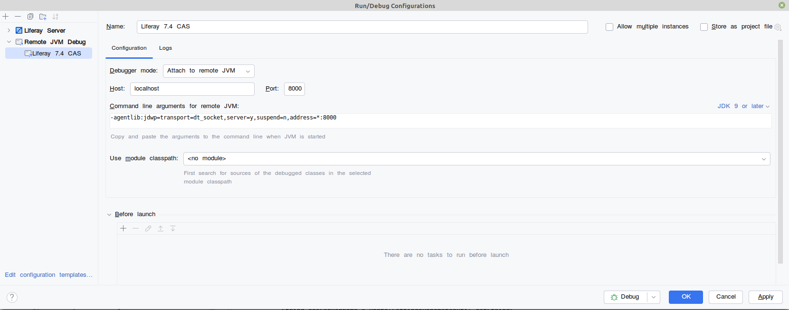
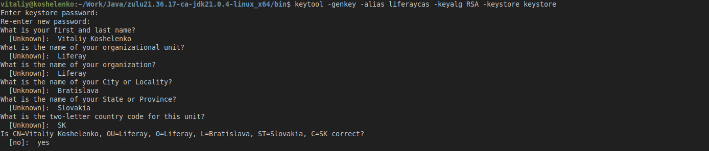
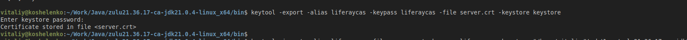
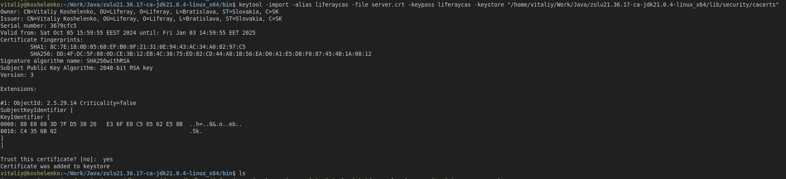

# CAS Integration in Liferay 7.4 GA125

### Useful Links

- Blog: https://liferay.dev/blogs/-/blogs/how-to-bring-back-cas-integration-to-liferay-7-4 
- Apereo CAS 7.1.x Deployment - WAR Overlays: https://fawnoos.com/2024/04/26/cas71x-gettingstarted-overlay/
- Official CAS Documentation: https://apereo.github.io/cas/7.1.x/index.html
- Liferay Documentation: https://learn.liferay.com/w/dxp/installation-and-upgrades/securing-liferay/configuring-sso/authenticating-with-cas
- 

### Liferay Setup

Initialize bundle: `blade gw initBundle`

Start Liferay on Java 21:

    export JRE_HOME=/home/vitaliy/Work/Java/zulu21.36.17-ca-jdk21.0.4-linux_x64
    ./catalina.sh run

### Deployment 

Deploy modules: `blade gw deploy`

Verify in Gogo Shell:

    g! lb cas    
    START LEVEL 20
    ID|State      |Level|Name
    1382|Active     |   15|Liferay Portal Security SSO CAS Settings Authentication Web (1.0.9)|1.0.9
    1383|Active     |   10|Liferay Portal Security SSO CAS API (5.0.12)|5.0.12
    1384|Active     |   10|Liferay Portal Security SSO CAS Implementation (4.0.14)|4.0.14

### Remote Debug Configuration

Start Liferay in debug mode: `./catalina.sh jpda run`

Check message in logs: `Listening for transport dt_socket at address: 8000`

Go to Run > Edit Configurations. Click the + icon to add a new configuration.

Specify name (e.g. `Liferay 7.4 CAS`), host (`localhost` for local environment), and port (`8000` by default).

Save configuration, and click on 'Debug' button to start debugging.

### HTTPs Configuration

Navigate to Java bin folder: `cd $JAVA_HOME/bin`

Generate certificate key and keystore file:

    keytool -genkey -alias liferaycas -keyalg RSA -keystore keystore

Export certificate: `keytool -export -alias liferaycas -keypass liferaycas -file server.crt -keystore keystore`

Import to Java key store: `keytool -import -alias liferaycas -file server.crt -keypass liferaycas -keystore "$JAVA_HOME/lib/security/cacerts"`

Copy keystore file to tomcat:

    cp keystore [PROJECT_PATH]/liferay74-cas-integration/bundles/tomcat/keystore

Update the server protocol in `portal-ext.properties`

    `web.server.protocol=https`

Add HTTPs Connector in `server.xml`:

    <Connector
            protocol="org.apache.coyote.http11.Http11NioProtocol"
            port="8443"
            maxThreads="200"
            scheme="https"
            secure="true"
            SSLEnabled="true"
            keystoreFile="/home/vitaliy/Work/Projects/portalworks/liferay74-cas-integration/bundles/tomcat/keystore/keystore" 
            keystorePass="liferaycas"
            clientAuth="false"
            sslProtocol="TLS"
    />

Start Liferay: `./catalina.sh jpda run`

Navigate to https://localhost:8443/ and check if portal is working properly on HTTPs.

### CAS Server Setup

Clone CAS Repository and navigate to created directory:

    git clone https://github.com/apereo/cas-overlay-template.git
    cd cas-overlay-template

Build with Gradle:

    ./gradlew build

Rename generated `build/libs/cas.war` file to `cas-web.war` and copy to `[Liferay]/tomcat/webapps` folder.

